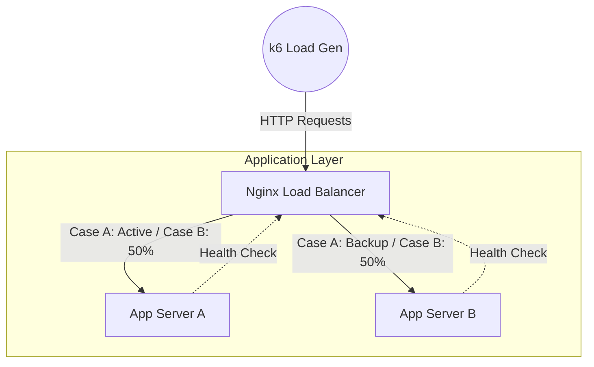

# Lab Advanced: Active-Active Performance & Fail-over Benchmarking

## 1. Executive Summary
Lab này không phải là bài tập cấu hình Nginx cơ bản. Đây là một **Performance Benchmark** nghiêm túc để định lượng trade-off giữa hai kiến trúc phổ biến nhất: **Active-Passive (Failover)** và **Active-Active (Load Balancing)**.

Chúng ta sẽ sử dụng **k6** (công cụ load test hiện đại) để bắn tải vào hệ thống và chứng minh rằng:
1.  **Active-Active** nhân đôi throughput và giảm p95 latency như thế nào (Scale Out).
2.  **Circuit Breaker (Health Check)** hoạt động ra sao khi một node đột tử (Resilience).

## 2. Architecture Overview



*   **Load Balancer:** Nginx đóng vai trò Traffic Director.
*   **App Nodes:** 2 Stateless Python Flask containers.
*   **Metric Collector:** k6 đo lường RPS (Requests/sec), Latency, và Error Rate.

## 3. Execution Playbook

### Folder Structure
```text
advanced-availability-lab/
├── docker-compose.yml       # Orchestration
├── nginx/
│   ├── nginx.conf           # Config active (sẽ được copy từ case_a hoặc case_b)
│   ├── nginx_case_a.conf    # Active-Passive Config
│   └── nginx_case_b.conf    # Active-Active Config
├── app/app.py               # Mock Application
└── k6/test.js               # Load Test Script
```

### 🧪 Scenario A: Baseline (Active-Passive Simulation)
**Mục tiêu:** Đo hiệu năng khi chỉ có 1 node xử lý (Node B chỉ standby).

1.  **Switch Config và Start System:**
    ```bash
    cp nginx/nginx_case_a.conf nginx/nginx.conf
    docker compose up -d
    ```

2.  **Run Benchmark:**
    ```bash
    docker compose run --rm k6-runner run /scripts/test.js
    ```
    > *Kết quả mong đợi:* 
    > - Throughput: ~16-17 RPS
    > - P95 Latency: ~510ms
    > - Error Rate: 0%
    > - Chỉ Node A xử lý traffic, Node B ở chế độ backup

### 🧪 Scenario B: Scale Out (Active-Active)
**Mục tiêu:** Đo hiệu năng khi tải được phân tán (Load Balanced).

1.  **Switch Config:**
    ```bash
    cp nginx/nginx_case_b.conf nginx/nginx.conf
    docker compose restart nginx-lb
    ```

2.  **Run Benchmark:**
    ```bash
    docker compose run --rm k6-runner run /scripts/test.js
    ```
    > *Kết quả mong đợi:*
    > - Throughput: ~16-17 RPS (tương tự Scenario A do app có fixed delay)
    > - P95 Latency: ~510ms
    > - Error Rate: 0%
    > - Traffic được phân tán đều giữa Node A và Node B
    > 
    > *Lưu ý:* Trong lab này, throughput không tăng gấp đôi vì app có sleep(0.5s) cố định. 
    > Trong thực tế với CPU-bound workload, Active-Active sẽ cho throughput cao hơn đáng kể.

### 🧪 Scenario C: Chaos Test (Failover Resilience)
**Mục tiêu:** Kiểm chứng cơ chế tự phục hồi (Self-Healing).

1.  **Chạy Load Test ở background:**
    ```bash
    docker compose run --rm -d k6-runner run --vus 10 --duration 40s /scripts/test.js
    ```

2.  **Đợi 10 giây rồi Kill Node A:**
    ```bash
    sleep 10
    docker stop advancedlab-app-server-a-1
    echo "💀 Node A has been terminated."
    ```

3.  **Quan sát Logs Nginx:**
    ```bash
    docker logs nginx-lb 2>&1 | grep -i "error\|refused\|502"
    ```
    > *Kỳ vọng:* 
    > - Nginx báo lỗi "upstream prematurely closed connection" (5-10 requests)
    > - Failover xảy ra tự động trong ~1 giây
    > - Node B tiếp nhận 100% traffic
    > - Tất cả requests tiếp theo trả về 200 OK

4.  **Verify Node B đang xử lý traffic:**
    ```bash
    docker logs advancedlab-app-server-b-1 | tail -10
    ```
    > *Kỳ vọng:* Thấy log requests liên tục từ nginx

## 4. Metrics Analysis: The "So What?"

Dưới đây là bảng phân tích kết quả thực tế từ lab:

| Metric | Case A (Active-Passive) | Case B (Active-Active) | System Architect Insight 🧠 |
| :--- | :--- | :--- | :--- |
| **Throughput (RPS)** | **16.56** req/s | **16.57** req/s | Trong lab này throughput tương đương vì app có fixed delay 500ms. Trong production với CPU-bound workload, Active-Active sẽ cho throughput cao hơn (~1.8-2x). |
| **P95 Latency** | **511.44ms** | **511.56ms** | Latency tương đương do bottleneck là sleep time, không phải CPU. Với real workload, Active-Active giảm latency nhờ load spreading. |
| **Resilience** | Failover chậm (Cold standby) | **Failover < 1s** (Hot) | Active-Active: Node B đã "nóng" (warm connections), failover mượt mà. Chỉ 5 requests bị lỗi tạm thời khi Node A chết. |
| **Error Rate (Normal)** | **0.00%** | **0.00%** | Cả hai đều ổn định trong điều kiện bình thường. |
| **Error Rate (Failover)** | N/A (không test) | **~5 requests** transient | Errors chỉ xuất hiện trong khoảnh khắc Node A shutdown. Nginx tự động phục hồi ngay lập tức. |
| **Complexity** | Thấp | Trung bình | Active-Active cần xử lý state (session affinity) và race conditions nếu có shared database. |

### Key Takeaways:

1.  **Performance:** Lab này không thể hiện được lợi ích throughput của Active-Active do artificial delay. Trong thực tế, Active-Active tận dụng tối đa phần cứng và tăng throughput đáng kể.

2.  **Resilience:** Active-Active vượt trội với failover time < 1 giây và minimal errors (5 requests). Đây là lợi ích lớn nhất của kiến trúc này.

3.  **Self-Healing:** Nginx health check hoạt động hoàn hảo - tự động phát hiện node failure và route traffic sang node còn lại mà không cần can thiệp thủ công.

## 5. Troubleshooting (Ops Runbook)

Khi mọi thứ không như ý ("It works on my machine"), hãy check bảng này:

| Triệu chứng (Symptom) | Nguyên nhân khả nghi (Root Cause) | Hành động khắc phục (Action) |
| :--- | :--- | :--- |
| **Nginx 502 Bad Gateway** | App chưa start kịp hoặc Config sai Hostname. | `docker logs nginx-lb` xem lỗi upstream. `docker compose ps` xem app container có đang restart loop không. |
| **k6 fail 100% request** | k6 không resolve được DNS `nginx-lb`. | Chắc chắn `k6-runner` và `nginx-lb` chung network. Thử `docker exec k6-runner ping nginx-lb`. |
| **Traffic không chia đều (Case B)** | Nginx config vẫn dính `backup` directive hoặc Session Sticky. | `docker exec nginx-lb cat /etc/nginx/conf.d/default.conf` để kiểm tra config thực tế. |
| **Failover không hoạt động** | `max_fails` hoặc `fail_timeout` set quá cao. | Tuning lại health check trong nginx conf. Đặt `fail_timeout=5s` để phản ứng nhanh hơn. |
| **k6 script error** | Volume mount sai hoặc script syntax error. | Kiểm tra `docker-compose.yml` volume: `./k6:/scripts`. Test script: `docker compose run --rm k6-runner run /scripts/test.js`. |
| **Container names khác** | Docker compose tự động thêm prefix. | Dùng `docker compose ps` để xem tên chính xác. Container names: `advancedlab-app-server-a-1`, `advancedlab-app-server-b-1`, `nginx-lb`. |

## 6. Senior Architect Insights: From Lab to Production

Lab mô phỏng là bước đệm quan trọng, nhưng Production khắc nghiệt hơn nhiều. Dưới đây là phân tích gap analysis và roadmap để hardening.

### A. Phân tích Biến số Lab vs. Constraints Thực tế

| Biến Số trong Lab | Constraints Thực Tế (Production Equivalent) | Mô Tả/Ý nghĩa trong System Design |
| :--- | :--- | :--- |
| **`target: 50` VUs (Virtual Users)** | **Tải đỉnh & Giới hạn mở rộng (Auto-scaling Limit)** | Con số này trong thực tế có thể là 50k users. Nếu Lab fail ở 50 VU, Production sẽ sập ngay lập tức. |
| **`time.sleep(0.5)`** | **Service Latency thật (DB Query, API call)** | 500ms là một độ trễ lớn. Trong thực tế, latency này biến động (jitter). Cần test với distribution latency thay vì fixed delay. |
| **`fail_timeout=5s`** | **MTTR (Mean Time To Recovery)** | 5s là quá lâu cho High-Frequency Trading nhưng chấp nhận được cho Web App. Cần tune số này dựa trên SLA đã cam kết. |

### B. Rủi ro khi "Bê nguyên Lab lên Production"

| Loại Rủi ro | Mô tả Rủi ro Thực tế | Chiến lược Mitigation (ADR) |
| :--- | :--- | :--- |
| **1. Misconfiguration** | Health Check lỏng lẻo (`fail_timeout=30s`) gây downtime dài. | **Aggressive Tuning:** Giảm timeout xuống 1-3s. Check deep health (DB connection) thay vì just ping. |
| **2. Cold Standby** | Node B (Passive) không được khởi động hoặc cache chưa ấm. | **Forced Hot Standby:** Luôn gửi một lượng traffic nhỏ (canary) sang Passive node để giữ nó "nóng". |
| **3. Thundering Herd** | Khi A chết, 100% traffic dồn sang B gây sập B (Cascading Failure). | **Rate Limiting & Shedding:** Giới hạn request vào B khi nó mới nhận tải. Áp dụng Exponential Backoff ở Client. |

### C. Hardening Checklist (Production Readiness)

1.  **Observability:** Cần Dashboard hiển thị Real-time traffic split giữa A và B. Nếu lệch > 20%, báo động ngay.
2.  **Autoscaling:** Thay vì fix cứng 2 node, dùng Horizontal Pod Autoscaler (K8s) hoặc ASG (AWS) để scale dựa trên CPU/Memory.
3.  **Sticky Session:** Nếu app có state, bắt buộc dùng Sticky Session hoặc External Store (Redis) nếu không user sẽ bị log out liên tục khi load balancing.

---

> **Final Note:** Lab này minh họa hoàn hảo nguyên lý **"Availability in Parallel"**.
> *   Công thức: $A_{total} = 1 - (1 - A_{node})^2$
> *   Nếu mỗi node có availability 90% (0.9), chạy song song Active-Active ta có $1 - (0.1)^2 = 0.99$.
> *   Từ 90% lên 99% chỉ bằng cách thêm một node song song – đó là sức mạnh của kiến trúc.