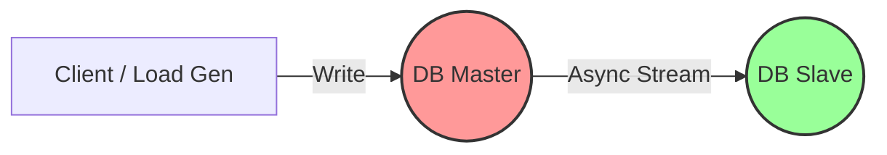

# Hands-on Lab: Replication Lag & The Reality of Data Loss

## 1. Executive Summary & Goal
Lab này không chỉ để chạy lệnh; mục tiêu là để **tận mắt chứng kiến giới hạn vật lý** của Async Replication. Chúng ta sẽ mô phỏng một sự cố thực tế production: Master chết đột ngột khi đang chịu tải cao.

**Mục tiêu cốt lõi:**
*   Chứng minh rằng **High Availability (Failover)** đôi khi phải trả giá bằng **Data Durability**.
*   Đo lường **RPO (Recovery Point Objective) thực tế** bị vi phạm như thế nào khi có Replication Lag.

## 2. Architecture Overview

Mô hình Active-Passive kinh điển với Async Replication:



*   **Critical Path:** Client nhận `200 OK` ngay khi Master ghi xong (không chờ Slave).
*   **Risk Window:** Khoảng thời gian (ms) dữ liệu đang bay từ Master sang Slave. Nếu Master chết lúc này -> **Mất dữ liệu vĩnh viễn.**

## 3. Engineering Playbook (Verification Steps)

Dưới đây là các bước để tái hiện sự cố ("Chaos Engineering" thu nhỏ).

### Bước 1: Khởi động môi trường Lab
Dựng stack PostgreSQL Active-Passive:

```bash
# Đảm bảo scripts có quyền execute
chmod +x postgres/*.sh

# Khởi động containers
docker compose up -d

# Kiểm tra trạng thái
docker compose ps
```

### Bước 2: Sanity Check (Kiểm tra sức khỏe)
Trước khi đập phá, hãy chắc chắn replication đang chạy ổn.

```bash
# 1. Ghi một bản ghi "đánh dấu" vào Master
docker exec db-master psql -U admin -d appdb -c "INSERT INTO transactions (value) VALUES ('Record A - Baseline');"

# 2. Kiểm tra xem Slave có nhận được không
docker exec db-slave psql -U admin -d appdb -c "SELECT value FROM transactions WHERE value LIKE 'Record A%';"
# -> Kỳ vọng: Trả về 'Record A - Baseline'
```

### Bước 3: Stress Test & Simulate Lag
Chúng ta sẽ bơm tải liên tục (High Write Throughput) để tạo ra độ trễ tự nhiên (replication lag).

```bash
# Bắn 1000 insert queries vào Master ở chế độ background
docker exec -d db-master psql -U admin -d appdb -f /high_write_load.sql

echo "🚀 Load test started. Target acquired..."

# Chờ 0.5s để tạo độ trễ "đủ chết người"
sleep 0.5 
```

### Bước 4: Chaos Injection (Kill Master)
Giết Master ngay lập tức (`SIGKILL`) để nó không kịp flush data sang Slave.

```bash
echo "🔥 Killing Master now!"
docker kill db-master
```

### Bước 5: Manual Failover (Promote Slave)
Trong tình huống thực tế, Orchestrator (K8s/Patroni) sẽ làm việc này. Ở đây chúng ta làm tay để hiểu quy trình.

```bash
# Thăng cấp Slave lên làm Master mới (chạy với user postgres)
docker exec -u postgres db-slave pg_ctl promote -D /var/lib/postgresql/data
echo "✅ Slave promoted. New regime begins."
```

### Bước 6: Post-Mortem Analysis (Kiểm đếm thiệt hại)
Kiểm tra xem bao nhiêu dữ liệu đã "bốc hơi".

```bash
# Chờ DB mới ổn định
sleep 5

# Đếm số record còn sót lại
docker exec db-slave psql -U admin -d appdb -c "SELECT COUNT(*) FROM transactions WHERE value LIKE 'Transaction-%';"

# Xem tổng số records
docker exec db-slave psql -U admin -d appdb -c "SELECT COUNT(*) as total_records FROM transactions;"
```

---

## 4. Deep Dive Analysis: Why It Matters?

### Kết quả quan sát (Expected Behavior):
Bạn sẽ thấy `COUNT < 1000` (ví dụ: 780/1000).
> **Kết luận:** Đã mất vĩnh viễn ~220 giao dịch.

### Kiến giải của Architect (The "So What?"):

1.  **Ảo tưởng về sự an toàn (False Sense of Security):**
    Chúng ta thường nghĩ "Có Backup/Slave là an toàn". Sai. Với Async Replication, Slave luôn luôn ở trong trạng thái **"quá khứ"**. Master chết, phần "tương lai" chưa kịp gửi đi sẽ biến mất.

2.  **RPO (Recovery Point Objective) Violation:**
    Nếu Business yêu cầu **Zero Data Loss** (RPO = 0), kiến trúc này **FAIL**.
    *   Để fix: Phải dùng **Synchronous Replication** (Master chờ Slave confirm mới trả về OK).
    *   Trade-off mới: Write Latency sẽ tăng lên, và nếu Slave chết, Master cũng dừng ghi (Availability giảm).

3.  **CAP Theorem trong thực tế:**
    Đây là minh chứng sống động của việc chọn **Availability (AP)**.
    *   Chúng ta chọn Async để Write nhanh (A), chấp nhận rủi ro mất data (C yếu).
    *   Khi Partition (Master chết/cách ly), chúng ta Promote Slave (ưu tiên A tiếp), và chấp nhận hệ quả mất data.