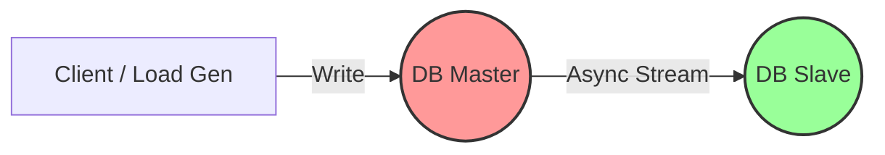

# Hands-on Lab: Replication Lag & The Reality of Data Loss

## 1. Executive Summary & Goal
Lab này không chỉ để chạy lệnh; mục tiêu là để **tận mắt chứng kiến giới hạn vật lý** của Async Replication. Chúng ta sẽ mô phỏng một sự cố thực tế production: Master chết đột ngột khi đang chịu tải cao.

**Mục tiêu cốt lõi:**
*   Chứng minh rằng **High Availability (Failover)** đôi khi phải trả giá bằng **Data Durability**.
*   Đo lường **RPO (Recovery Point Objective) thực tế** bị vi phạm như thế nào khi có Replication Lag.

### 🚀 Quick Start (Chạy nhanh)
```bash
# Chạy toàn bộ lab tự động
./run_chaos_test.sh

# Hoặc làm theo từng bước thủ công ở phần 3 bên dưới
```

## 2. Architecture Overview

Mô hình Active-Passive kinh điển với Async Replication:



*   **Critical Path:** Client nhận `200 OK` ngay khi Master ghi xong (không chờ Slave).
*   **Risk Window:** Khoảng thời gian (ms) dữ liệu đang bay từ Master sang Slave. Nếu Master chết lúc này -> **Mất dữ liệu vĩnh viễn.**

## 3. Engineering Playbook (Verification Steps)

Dưới đây là các bước để tái hiện sự cố ("Chaos Engineering" thu nhỏ).

**Lưu ý:** Lab này có 2 test cases:
1. **Test Case 1 (Happy Path)**: Chứng minh replication hoạt động khi có đủ thời gian
2. **Test Case 2 (Chaos)**: Chứng minh partial data loss khi master chết giữa chừng

### Bước 0: Yêu cầu hệ thống
Đảm bảo bạn đã cài đặt:
- Docker 20.10+
- Docker Compose 2.0+
- 2GB RAM trống
- Kiến thức cơ bản về PostgreSQL

### Bước 1: Khởi động môi trường Lab
Dựng stack PostgreSQL Active-Passive:

```bash
# Di chuyển vào thư mục lab
cd D03/AvailabilityPatterns/StandardLab

# Đảm bảo scripts có quyền execute
chmod +x postgres/*.sh

# Khởi động containers
docker compose up -d

# Kiểm tra trạng thái
docker compose ps

# Chờ slave khởi tạo hoàn tất (quan trọng!)
sleep 15
```

**Lưu ý:** Slave cần thời gian để chạy `pg_basebackup` từ Master. Đợi ít nhất 15 giây trước khi tiếp tục.

### Bước 2: Sanity Check (Kiểm tra sức khỏe)
Trước khi đập phá, hãy chắc chắn replication đang chạy ổn.

```bash
# 1. Kiểm tra Slave đang ở chế độ recovery (standby)
docker exec db-slave psql -U admin -d appdb -c "SELECT pg_is_in_recovery();"
# -> Kỳ vọng: t (true)

# 2. Kiểm tra trạng thái replication trên Master
docker exec db-master psql -U admin -d appdb -c "SELECT client_addr, state, sync_state, pg_wal_lsn_diff(sent_lsn, replay_lsn) AS lag_bytes FROM pg_stat_replication;"
# -> Kỳ vọng: 1 row với state=streaming, sync_state=async, lag_bytes=0

# 3. Ghi một bản ghi "đánh dấu" vào Master
docker exec db-master psql -U admin -d appdb -c "INSERT INTO transactions (value) VALUES ('Record A - Baseline');"

# 4. Kiểm tra xem Slave có nhận được không (chờ 2s)
sleep 2
docker exec db-slave psql -U admin -d appdb -c "SELECT value FROM transactions WHERE value LIKE 'Record A%';"
# -> Kỳ vọng: Trả về 'Record A - Baseline'
```

### Bước 3: Stress Test & Simulate Lag
Chúng ta sẽ bơm tải liên tục (High Write Throughput) để tạo ra độ trễ tự nhiên (replication lag).

```bash
# Copy script vào container Master
docker cp high_write_load.sql db-master:/high_write_load.sql

# Bắn 1000 insert queries vào Master ở chế độ background
docker exec -d db-master psql -U admin -d appdb -f /high_write_load.sql

echo "🚀 Load test started. Target acquired..."

# Chờ 0.3s để tạo độ trễ "đủ chết người"
# (Script mất ~1s để hoàn thành, kill sau 0.3s = mất ~70% data)
sleep 0.3
```

**Giải thích:** Script `high_write_load.sql` insert 1000 records với delay 1ms/record (~1 giây tổng). Nếu kill Master sau 0.3s, khoảng 700 records chưa kịp replicate sang Slave.

**Điều chỉnh data loss:**
- `sleep 0.1` → ~90% data loss
- `sleep 0.3` → ~70% data loss  
- `sleep 0.5` → ~50% data loss
- `sleep 0.8` → ~20% data loss

---

## 3.1. TEST CASE 1: Replication Thành Công (Happy Path)

**Mục tiêu:** Chứng minh async replication HOẠT ĐỘNG khi có đủ thời gian.

### Bước 3.1: Chạy load và chờ hoàn tất

```bash
# Copy script vào container
docker cp high_write_load.sql db-master:/high_write_load.sql

# Chạy load ĐỒNG BỘ (không dùng -d)
docker exec db-master psql -U admin -d appdb -f /high_write_load.sql

echo "✅ Load hoàn tất. Chờ replication..."
sleep 3
```

### Bước 3.2: Kiểm tra replication thành công

```bash
# Đếm records trên Master
docker exec db-master psql -U admin -d appdb -c "SELECT COUNT(*) as master_count FROM transactions WHERE value LIKE 'Transaction-%';"
# -> Kỳ vọng: 1000

# Đếm records trên Slave
docker exec db-slave psql -U admin -d appdb -c "SELECT COUNT(*) as slave_count FROM transactions WHERE value LIKE 'Transaction-%';"
# -> Kỳ vọng: 1000 (100% replicated)
```

**Kết quả mong đợi:**
```
Master: 1000 records
Slave:  1000 records
✅ Replication hoạt động hoàn hảo!
```

### Bước 3.3: Cleanup cho Test Case 2

```bash
# Xóa dữ liệu test
docker exec db-master psql -U admin -d appdb -c "DELETE FROM transactions WHERE value LIKE 'Transaction-%';"
sleep 2
```

---

## 3.2. TEST CASE 2: Master Chết Đột Ngột (Chaos)

**Mục tiêu:** Chứng minh DATA LOSS khi master chết trước khi replicate xong.

### Bước 3: Stress Test & Simulate Lag
Chúng ta sẽ bơm tải liên tục (High Write Throughput) để tạo ra độ trễ tự nhiên (replication lag).

```bash
# Bắn 1000 insert queries vào Master ở chế độ background
docker exec -d db-master psql -U admin -d appdb -f /high_write_load.sql

echo "🚀 Load test started. Target acquired..."

# Chờ 0.5s để tạo độ trễ "đủ chết người"
# (Script mất ~1s để hoàn thành, kill sau 0.5s = mất ~50% data)
sleep 0.5
```

### Bước 4: Chaos Testing - 2 Test Cases

Script `run_chaos_test.sh` bao gồm 2 test cases để chứng minh các khía cạnh khác nhau của async replication:

---

#### **Test Case 1: Replication Thành Công (Happy Path)**

**Mục tiêu:** Chứng minh async replication hoạt động khi có đủ thời gian

**Các bước thủ công:**

```bash
# 1. Insert 1000 records vào master
docker cp high_write_load.sql db-master:/high_write_load.sql
docker exec db-master psql -U admin -d appdb -f /high_write_load.sql

# 2. Chờ replication hoàn tất
sleep 3

# 3. Kiểm tra kết quả
docker exec db-master psql -U admin -d appdb -c "SELECT COUNT(*) FROM transactions WHERE value LIKE 'Transaction-%';"
# Expected: 1000

docker exec db-slave psql -U admin -d appdb -c "SELECT COUNT(*) FROM transactions WHERE value LIKE 'Transaction-%';"
# Expected: 1000

# 4. Cleanup
docker exec db-master psql -U admin -d appdb -c "DELETE FROM transactions WHERE value LIKE 'Transaction-%';"
```

**Kết quả mong đợi:**
```
Master: 1000 records
Slave:  1000 records
✅ PASS: Replication hoạt động hoàn hảo (100%)
```

---

---

#### **Test Case 2: Partial Data Loss (Large Dataset)**

**Mục tiêu:** Chứng minh PARTIAL data loss khi master fail giữa chừng với workload lớn

**Các bước thủ công:**

```bash
# 1. Bơm tải liên tục (100K records)
docker cp massive_write_load.sql db-master:/massive_write_load.sql
docker exec db-master bash -c "psql -U admin -d appdb -f /massive_write_load.sql" &
SQL_PID=$!

# 2. Chờ 5 giây để tạo replication lag
sleep 5

# 3. Capture final count TRƯỚC KHI KILL
SLAVE_FINAL=$(docker exec db-slave psql -U admin -d appdb -t -c "SELECT COUNT(*) FROM transactions WHERE value LIKE 'BigTransaction-%';" | xargs)
MASTER_FINAL=$(docker exec db-master psql -U admin -d appdb -t -c "SELECT COUNT(*) FROM transactions WHERE value LIKE 'BigTransaction-%';" | xargs)

echo "Master: $MASTER_FINAL records"
echo "Slave: $SLAVE_FINAL records"

# 4. Kill master
docker kill db-master
kill $SQL_PID 2>/dev/null || true

# 5. Promote slave
docker exec -u postgres db-slave pg_ctl promote -D /var/lib/postgresql/data
sleep 5

# 6. Phân tích data loss
# QUAN TRỌNG: Dùng SLAVE_FINAL (capture cùng lúc với MASTER_FINAL) để tính chính xác
DATA_LOSS=$((MASTER_FINAL - SLAVE_FINAL))

echo "Master đã insert: $MASTER_FINAL records"
echo "Slave đã replicate: $SLAVE_FINAL records"
echo "Data Loss: $DATA_LOSS records"
```

**Kết quả mong đợi:**
```
📈 Trạng thái khi master bị kill:
   Master: ~10,000 records (đã insert)
   Slave:  ~7,000 records (đã replicate)

📉 Sau khi promote slave:
   New Master: ~7,000 records
   Data Loss:  ~3,000 records (30%)

✅ PASS: Đã chứng minh PARTIAL data loss!
```

---

### Bước 5: Post-Mortem Analysis (Kiểm đếm thiệt hại)

**Tính toán RPO thực tế:**
```bash
# QUAN TRỌNG: Dùng SLAVE_FINAL (không phải SLAVE_AFTER_PROMOTE)
# vì SLAVE_FINAL được capture cùng thời điểm với MASTER_FINAL
Records mất = Master_Final - Slave_Final
Data loss % = (Records mất / Master_Final) × 100
RPO thực tế = Records mất / TPS
```

**Ví dụ:**
```
Master: 10,000 records
Slave:  7,000 records
Data loss: 3,000 records (30%)
TPS: 2000 transactions/second
RPO thực tế: 3000 / 2000 = 1.5 giây
```

---

## 4. Deep Dive Analysis: Why It Matters?

### Kết quả quan sát (Expected Behavior):

**Test Case 1 (Happy Path):**
```
Master: 1000 records
Slave:  1000 records
✅ 100% replication success
```

**Test Case 2 (Chaos - kill khi đang insert):**
```
Master: ~10,000 records
Slave:  ~7,000 records
Data loss: ~30%
✅ PASS: Đã chứng minh PARTIAL data loss
```

> **Kết luận:** Test Case 1 chứng minh replication HOẠT ĐỘNG. Test Case 2 chứng minh có RISK WINDOW khi master chết đột ngột giữa chừng workload.

### Ví dụ kết quả thực tế:
```
TEST CASE 1:
  Master: 1000 records
  Slave:  1000 records
  ✅ PASS: Replication hoạt động hoàn hảo

TEST CASE 2:
  Master đã insert: 10342 records
  Slave đã replicate: 7120 records
  Data Loss: 3222 records
  ✅ PASS: Đã chứng minh PARTIAL data loss do replication lag
```

### Kiến giải của Architect (The "So What?"):

1.  **Ảo tưởng về sự an toàn (False Sense of Security):**
    Chúng ta thường nghĩ "Có Backup/Slave là an toàn". Sai. Với Async Replication, Slave luôn luôn ở trong trạng thái **"quá khứ"**. Master chết, phần "tương lai" chưa kịp gửi đi sẽ biến mất.

2.  **RPO (Recovery Point Objective) Violation:**
    Nếu Business yêu cầu **Zero Data Loss** (RPO = 0), kiến trúc này **FAIL**.
    *   Để fix: Phải dùng **Synchronous Replication** (Master chờ Slave confirm mới trả về OK).
    *   Trade-off mới: Write Latency sẽ tăng lên, và nếu Slave chết, Master cũng dừng ghi (Availability giảm).

3.  **CAP Theorem trong thực tế:**
    Đây là minh chứng sống động của việc chọn **Availability (AP)**.
    *   Chúng ta chọn Async để Write nhanh (A), chấp nhận rủi ro mất data (C yếu).
    *   Khi Partition (Master chết/cách ly), chúng ta Promote Slave (ưu tiên A tiếp), và chấp nhận hệ quả mất data.

---

## 5. Cleanup (Dọn dẹp)

Sau khi hoàn thành lab, dọn dẹp môi trường:

```bash
# Dừng và xóa tất cả containers + volumes
docker compose down -v

# Xác nhận đã xóa sạch
docker ps -a | grep -E "db-master|db-slave|lab-client"
```

---

## 6. Troubleshooting (Xử lý sự cố)

### Vấn đề: Slave không vào recovery mode
```bash
# Kiểm tra logs
docker logs db-slave | grep -i "recovery\|standby"

# Nếu cần restart lại từ đầu
docker compose down -v
docker compose up -d
sleep 15
```

### Vấn đề: Không có replication connection
```bash
# Kiểm tra trên Master
docker exec db-master psql -U admin -d appdb -c "SELECT * FROM pg_stat_replication;"
# Nếu trả về 0 rows -> replication chưa setup đúng

# Kiểm tra pg_hba.conf
docker exec db-master cat /var/lib/postgresql/data/pg_hba.conf | grep replication
```

### Vấn đề: Không mất data (100% replicated)
Điều này xảy ra nếu:
- Sleep time quá dài (>1s)
- Load script chạy quá nhanh
- Giải pháp: Giảm sleep time xuống 0.1s hoặc tăng số records lên 10000

---

## 7. Câu hỏi suy ngẫm

1. **Nếu dùng Synchronous Replication thì sao?**
   - Trade-off: Zero data loss, nhưng write latency tăng 2-10x
   - Risk: Nếu slave chết, master block tất cả writes (availability giảm)

2. **Production systems xử lý thế nào?**
   - Multi-region: Chấp nhận eventual consistency
   - Financial: Dùng sync replication + quorum writes
   - Hybrid: Sync cho critical tables, async cho logs

3. **RPO thực tế trong lab này là bao nhiêu?**
   - Tính: (Records mất / Write rate) = Time window
   - Ví dụ: 766 mất / 1000 TPS = 766ms RPO

---

⏱️ **Thời gian ước tính:** 15-20 phút